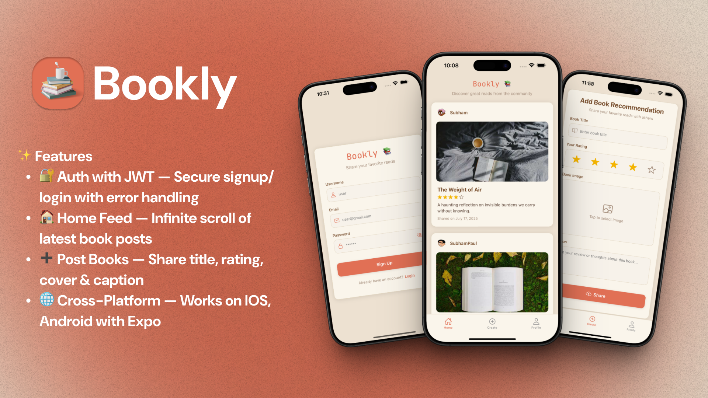

<h1 align="center">📚 Bookly – Full‑Stack React Native App 🚀</h1>



---

# Overview

Bookly is a full-stack, cross-platform app for book lovers. Built with React Native, Expo, Node.js, and MongoDB, it lets users browse, create, and manage book posts with a modern UI and robust backend.

## Features

- 🔐 **Authentication** – Signup & login with JWT, error handling
- 🏠 **Home Feed** – Newest-first posts, infinite scrolling
- ➕ **Create Post** – Title, rating, cover image & caption (all required)
- 👤 **Profile** – User info & their posts
- 🗑️ **Delete Post** – Confirmation before removal
- 🌐 **Web Support** – Run on `localhost` in the browser
- 🚪 **Logout**

## Tech Stack

- **Frontend:** React Native, Expo, Expo Router
- **Backend:** Node.js, Express, MongoDB
- **Image Uploads:** Cloudinary
- **Auth:** JWT (JSON Web Tokens)

---

## Getting Started

### Mobile App Setup

1. **Clone the repository**
   ```sh
   git clone https://github.com/ItisSubham/Bookly-App.git
   cd Bookly-App
   ```
2. Install dependencies and start Expo:
   ```bash
   cd mobile
   npm install
   npx expo start
   ```
3. Open the app in Expo Go, Android/iOS simulator, or browser.

---

## Folder Structure

### App

```
App/
├── app/                # Screens & routing
├── assets/             # Fonts, images, styles
├── components/         # Reusable UI components
├── constants/          # API endpoints, colors
├── lib/                # Utility functions
├── store/              # State management
├── package.json        # Dependencies & scripts
├── tsconfig.json       # TypeScript config
├── app.json            # Expo config
└── README.md           # Docs
```

### Backend

```
backend/
├── src/
│   ├── models/         # Mongoose models
│   ├── routes/         # Express routes
│   ├── middleware/     # Auth, error handling
│   ├── lib/            # Cloudinary, DB, cron
│   └── index.js        # Entry point
├── package.json        # Dependencies & scripts
├── .env.example        # Sample env vars
└── README.md           # Docs
```

---

## API Endpoints

- **Auth:** `/api/auth` (login, signup)
- **Books:** `/api/books` (CRUD)
- **User:** `/api/user` (profile)

See `/backend/README.md` for details.
